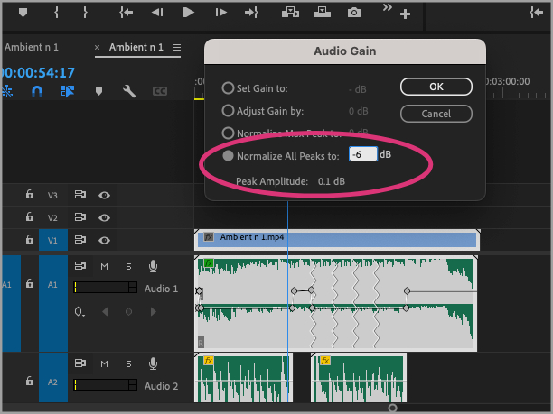

# Basic Audio Editing in Premiere

As we've discussed, audio is a critical part of any film or video. Premiere has sophisticated audio-editing capabilities, which is both a good thing and a bad thing. It's great that you can do sophisticated things with this tool, but it also means that getting started on audio-editing can be a little bit intimidating.

So in this tutorial, we'll learn about some basic audio-editing in Adobe Premiere: substituting one audio track for another, lowering and raising the volume on a track, layering a voiceover, and altering the volume to accommodate a voiceover. We'll also learn about a couple of cool tricks that Premiere has tucked away!

We'll use a lot of preset effects today, in order to keep things simple. Once you're feeling more confident, you might want to learn how to make more granular edits. So at the end of the tutorial, you'll find links to resources that will help you understand audio in more depth.

# Table of contents
1 Download media
2 Import media
3 Open the video clip
4 Pause to notice a new icon
5 Unlink the audio from your video
6 Delete the audio track
7 Examine our new audio track
8 Switch workspaces
9 Notating volume in decibels
10 Add your new soundtrack to the sequence
11 Tell Premiere what kind of audio we're working with
12 Adjust the clip's volume
13 A cool trick
14 Add our voiceover
15 Modulate the voice's volume (1)
16 Modulate the voice's volume (2)
17 Note keyframes
18 Normalize your volume
19 Examine other capabilities
20 Record your voiceover
21 Learning more about audio in Premiere

# 1 Download media

Last week, you used your own media to build your video project, but this week, to make things a little simpler, I'll provide you with a few clips.

Please download the zipped file [here](https://www.dropbox.com/s/psa6gu6y7u8qsso/premiere_audio.zip?dl=0) (rel=undefined target=undefined), and double-click it to expand the files.

Here are the files and their sources: 

- [Piano Flight by EDRECORDS](https://licensing.jamendo.com/en/track/1975023/piano-flight) (rel=undefined target=undefined)
- [Ambient n 1, by Gian Paolo Forni](https://vimeo.com/787395066) (rel=undefined target=undefined)
- ["Sonnett 15," by William Shakespeare, read by John Richetti ](https://writing.upenn.edu/pennsound/x/Richetti-Sonnets.php) (rel=undefined target=undefined)

# 2 Import media

As we did last week, double-click on Adobe Premiere to open it. Then click on the blue **New Project** button, navigate to the folder you just downloaded, and click on the **New Project** button. (Be sure to save your new project, too.)

# 3 Open the video clip

From the **Project:** or **Media Browser** tab in the project pane, double-click on the clip called **Ambient.mp4** to play it in the source monitor. Then drag it to the timeline, dropping it there to begin our new sequence.

# 4 Pause to notice a new icon

If you have the **Project:** tab open in the project pane, you may notice something strange, which we didn't address last week. As soon as you dragged the clip to the timeline, a new file appeared in your list of files, with the same name as the video clip you just added to your sequence. What's going on?

If you hover over the new file's icon, you'll reveal a clue: it's a **sequence**, with the same name as the clip you just added. As soon as you create a new sequence in your Premiere project, that sequence is given the same name as the clip you've just added, and it's also listed in your **Project** tab like every other piece of media. This allows you to make multiple sequences in the same project, and combine them like clips to create longer video works.

# 5 Unlink the audio from your video

The video we imported has its own soundtrack, but we're not going to use it. In order to dispose of it, let's first separate the video and audio components of the clip.

**Right-click** (or **control-click**) on the audio portion of the Ambient clip. Then, from the menu that pops up, select **Unlink**.

This allows you to shift the soundtrack in time, edit it separately from the video, or (as we're about to do) get rid of it entirely.

# 6 Delete the audio track

Select the audio portion of the "Ambient n. 1" clip. (You may have to click elsewhere on the timeline first to deselect the video portion of the clip.)

Now, with the audio track selected, press the **delete** key on your keyboard. Your audio track is gone!

# 7 Examine our new audio track

Double-click on the sound file called "Piano Flight" to open it in the source monitor. Because it's just a sound file (with no video), it opens as a waveform.

But you might be surprised to notice that there are actually *two* waveforms in the source monitor, one on top of the other. Why?

That's because the audio clip we're using is in **stereo**, meaning it has two **channels**, one for the left and one for the right. When you're working with audio, the term "channel" refers to a single stream of recorded sound. And we use "left" and "right" because one channel is meant to go to the left ear and one channel is meant to go to the right ear.

When an audio clip is in stereo, it's as though the same clip was recorded by two microphones at the same time, one pointing left and one pointing right. Otherwise, the two channels are exactly the same!

When an audio clip only has one channel, we say it's in **mono**. And, in fact, a stereo clip is really just two mono channels! Usually, when we edit a stereo track in Premiere, we'll want to make changes to both of the channels at the same time, so most edits apply to both channels by default. Later, though, if you'd like, you can [decouple the channels](https://www.premiumbeat.com/blog/stereo-to-dual-mono-premiere-pro/) (rel=undefined target=undefined) and work on each separately.

# 8 Switch workspaces

As we learned last week, Premiere has multiple **workspaces**: arrangements of panels and tabs to suit different workflows. So far, we've been working in the Editing workspace.

Let's switch to the Audio workspace. From the **Window** menu at the top of your screen, select **Workspaces**, and then **Audio**.

Now your panels are rearranged. You have a new panel on the far right called **Essential Sound**, and you also have an audio meter just to the right of your timeline. When you play an audio track, the levels in the audio meter will show the volume, one level for each channel.

# 9 Notating volume in decibels

Sound is denoted in decibels (dB). If you look closely at the audio meter, you'll see that the top of the meter—indicating the loudest sound—is actually a zero. The larger negative numbers below zero indicate softer volumes.

What happens if the audio is so loud it goes past zero? Then we say the audio is **clipped**. That means that the audio is being played back at a volume that exceeds the quality at which it was recorded. When that happens, you'll hear distortion. So you want to keep your volume below zero—preferable somewhere in the -6 to -12 dB range.

As you play the audio clip, try clicking and unclicking the **S** icons below each of the levels. The "S" stands for "solo," and clicking this box allows you to hear each channel in isolation

# 10 Add your new soundtrack to the sequence

Drag the "Piano Flight" icon onto the timeline, to track **A1**, to add it to our sequence. (It's a different length from our video, but that's OK!)

If you press **play** in the program monitor, you'll see that our video now has a new soundtrack!

# 11 Tell Premiere what kind of audio we're working with

Premiere comes with some settings that are optimized for different kinds of audio. If we tell Premiere what kind of audio we're working with, we can make some settings available that will simplify our editing process.

Select the audio clip we just imported and, in the **Essential Sound** panel, make sure the **Edit** tab is selected. Once it is, select the **Music** button to indicate to Premiere that we're working with music. Now the Essential Sound panel displays many more options.

# 12 Adjust the clip's volume

We're going to layer a voice over our music track, so let's lower the volume of the music. Near the bottom of the Essential Sound panel, you'll find a checkbox for **Clip Volume**. Check the box marked **Level** and lower the volume somewhat—try somewhere around -12 dB.

When you play the sequence again, you'll notice that the maximum level our audio "hits" on the audio meters (indicated by a yellow horizontal line) is now lower.

# 13 A cool trick

Want to try a cool trick? Let's get Premiere to automatically lengthen our audio clip so that it's the same length as our video.

This is a fun built-in capability of Premiere. It analyzes an audio track and edits it so that it matches the length you specify.

To the immediate left of the track controls is a vertical palette of tools. Third from the top is the **Ripple Edit** tool, denoted by a double-headed arrow with a vertical line through the center. We're not going to use that tool, though. Just hold the button down until a menu appears, and from that menu, select **Remix Tool**.

A new cursor appears. Move it to the end of the audio track on your timeline, then click the edge of the track and drag, extending the clip so that it's about the same length as your video clip.

After a moment or two of thinking, the audio clip extends itself. If you look at the audio clip's waveform, you'll see several white arrows, indicating where the edits took place. Try playing the song again; it's pretty seamless! You can also try shortening the audio, and Premiere will do its best to cut the track down to size.

Before continuing, click the **Selection** tool button (it looks like an arrow) from the tool palette so that we can continue clicking as normal.

# 14 Add our voiceover

We're going to add another audio track, this one consisting of a recording of the poet John Richetti reading Shakespeare's "Sonnet 15."

Remember that in Premiere, you can layer tracks, one on top of the other. If you have two audio tracks playing simultaneously, you'll hear both of them.

From your project pane, grab the icon for "Sonnet 15" and drag it to the timeline, adding it to track **A2**. (It won't be the same length as the other tracks; that's OK!) If you look at the clip closely, you'll notice that it differs from the previous clip in that it was recorded in **mono**. 

# 15 Modulate the voice's volume (1)

Try playing back our sequence. It sounds OK, but the music is a little overwhelming, even though we've already lowered the volume. We could lower the volume even further, but it would be ideal if the volume only decreased while the voice was speaking. Let's try another cool trick Adobe Premiere offers.

["Ducking"](https://en.wikipedia.org/wiki/Ducking) (rel=undefined target=undefined) is an audio technique in which one audio track's volume is lowered to highlight another audio track. We could do it manually, but Premiere will do it for us automatically.

First, let's tell Premiere what kind of audio we're working with, just the way we told it we were working with music earlier. Click on "Sonnet 15," the clip we just moved to the timeline, to select it. Then, in the Essential Sound panel, click the button for **Dialogue**.

# 16 Modulate the voice's volume (2)

Now, click on the "Piano Flight" clip to select it (**1**).

Then, in the Essential Sound panel, click the box for **Ducking** (**2**).

Finally, at the bottom of the Essential Sound panel, click **Generate keyframes**.

Play your sequence again to hear how the music fades out to accommodate the dialogue track.

Try adjusting the **Sensitivity**, **Duck Amount**, **Fade Duration**, and **Fade Position** controls to see how they affect the project's audio. Try clicking and unclicking the **Clip volume** checkbox.

Perhaps you'd like to [download another sonnet](https://writing.upenn.edu/pennsound/x/Richetti-Sonnets.php) (rel=undefined target=undefined) (from the linked website, click on **MP3**, then click on the three vertical dots, then select **Download**) and add it to your audio track. Then mark it as Dialogue and regenerate keyframes for the musical track in order to accommodate the new voiceover.

# 17 Note keyframes

Because this is our first time working with audio, we used a lot of preset effects on our tracks. If you're a true audiophile, however, you'll eventually want to learn more about how to adjust sound manually, including by using **keyframes**.

You may remember that in our last tutorial, we saw how **keyframes**—tiny, circle-shaped "handles" on our timeline—could be used to indicate the beginning and end of visual effects. Keyframes work the same way for audio effects!

To see the keyframes we've already added, move your cursor to the dividing line between track A1 and track A2 on the timeline's trackhead control. Drag the divider downward to heighten track A1, making it easier to see the waveform.

When you "generated keyframes" for the ducking step, you added tiny handlebars, or keyframes, to the track. Try clicking and dragging the keyframes. You'll see that this changes the shape of the white line—called the "rubber band"—that indicates the volume of the track.

With keyframes, you can fine-tune your audio as carefully as you'd like. Perhaps you'd like the fade-in to be more gradual. In that case, you'd grab a keyframe and draw a gentler slope on your musical track.

You can also add keyframes to your track by selecting the pen tool from the palette just to the left of the timeline and using it to add new keyframes.

# 18 Normalize your volume

You've made a lot of adjustments to your various audio tracks. When we adjust clips individually, we can accidentally make individual tracks too loud or soft, leading to an erratic volume for the overall sequence.

To avoid this, let's **normalize** our tracks. That adjusts the maximum volume of all the clips so that they're in the same range.

To do this, select all the clips on your timeline. (You can hold down the **shift** key and click or press **command** and then **A**.) Then right-click (or control-click) on one of the selected tracks and, from the menu that pops up, select **Audio Gain... **In the ensuing dialogue box, click the radio button for **Normalize all peaks to... **and enter a value. Remember that when audio gets to zero and above it can clip; try entering a value somewhere between -6 and -12.

Then listen to your sequence again. The volume should remain consistent overall, even as individual tracks get louder or softer.

# 19 Examine other capabilities

With a dialogue clip selected, take a closer look at the Essential Sound panel. Try clicking on some of the headings, like **Loudness** or **Repair**. You'll see that you have options for things like **Reduce Noise** and **DeHum**. These could come in very handy, depending on the quality of your own dialogue tracks, so remember that they're there!

If you scroll down to the checkbox marked **EQ**, you'll find that you can even apply effect profiles to your voice clips, so that the voice sounds as though it's "Locked in the trunk" or "On the telephone." (Use these sparingly, though, unless you want to be a cheeseball!) 

When you want to hear the results of your edits, you can play the track with the **S** highlighted on the trackhead control, to indicate that you want to play the track on its own.

# 20 Record your voiceover

You probably don't want to do it right now, but when you're ready, you can record your voiceover directly to Premiere.

If you look closely at the trackhead controls for the audio tracks, you'll see that they include a microphone icon. Clicking that microphone allows you to record your own voiceover track while your video plays.

For more on recording a voiceover in Premiere, see [this page](https://helpx.adobe.com/premiere-pro/using/recording-audio.html#:~:text=Record%20a%20voice%2Dover%20on%20an%20audio%20track%20from%20the%20Timeline) (rel=undefined target=undefined). For more on how to record good-quality audio (consider your closet!), see [this page](https://guides.library.ucsc.edu/DS/Resources/RecordingAudioAtHome) (rel=undefined target=undefined).

# 21 Learning more about audio in Premiere
You've learned how to split audio and video, to adjust the volume of individual tracks, to duck audio for dialogue, to manipulate keyframes, and to record your own voice. That's a lot! And it will likely be enough to carry you through your digital storytelling project.

However, there's a lot more you can do with audio in Premiere, such as repair terrible audio tracks, add reverb, and get rid of background noise.

[This chapter](https://learning.oreilly.com/library/view/adobe-premiere-pro/9780137624997/ch11.xhtml#:-:text=11.%20Improving%20Audio) (rel=undefined target=undefined) of *Adobe Premiere Pro Classroom in a Book* will walk you through the steps for improving audio using preset effects. (You'll need to be on the UCLA campus or using the UCLA VPN in order to access it.)

[This chapter](https://learning.oreilly.com/library/view/adobe-premiere-pro/9781681986883/compend_6.xhtml#:-:text=6%20Audio%20Effects,%26%20Mastering) (rel=undefined target=undefined) of *Adobe Premiere Pro* will give you an exhaustive look at audio editing features. (You'll also need to be on a UCLA network to use this book.)

Or if you prefer learning from video, [this chapter](https://www.linkedin.com/learning-login/share?account=95316746&amp;forceAccount=false&amp;redirect=https%3A%2F%2Fwww.linkedin.com%2Flearning%2Fpremiere-pro-2022-essential-training%2Faudio-editing-building-the-soundtrack%3Ftrk%3Dshare_video_url%26shareId%3DnbSBCAguQmKkc22zZL0qPg%253D%253D) (rel=undefined target=undefined) (UCLA or VPN only) of the LinkedIn Learning course [Premiere Pro 2022 Essential Training](https://www.linkedin.com/learning-login/share?account=95316746&amp;forceAccount=false&amp;redirect=https%3A%2F%2Fwww.linkedin.com%2Flearning%2Fpremiere-pro-2022-essential-training%3Ftrk%3Dshare_ent_url%26shareId%3DnbSBCAguQmKkc22zZL0qPg%253D%253D) (rel=undefined target=undefined) will give you a detailed look at Premiere's audio editing functions.

